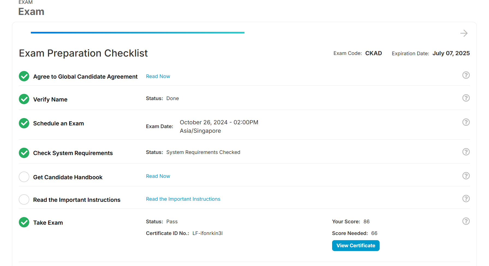

I've finally passed my CKAD exam! :star_struck:



Hopefully through my experience, it can help others pass it as well!

# Preparation

- Materials that are super useful in helping me prepare:
*This is NOT sponsored and i have no affilation to any of the below mentioned brands/person*

1) kodekloud's [Udemy Labs - Certified Kubernetes Application Developer](https://learn.kodekloud.com/courses/udemy-labs-certified-kubernetes-application-developer)
- I find myself constantly redoing the 2 lightning labs & 2 mock test daily. It helped me increased my speed as well as get familiar with all the imperative commands
- I do recommend anyone who has no to zero experience in kubernetes to sign up for [Mumshad Mannambeth's CKAD course in udemy](https://www.udemy.com/course/certified-kubernetes-application-developer/) as it gives you access to the above mentioned kodekloud environment unlimited, hence i was able to constantly redo again and again. I think it was a "hack" that i was able to keep redoing it that helped me in my actual exam as compared to killer.sh which has a 36 hours window with 2 tries only

2) [killercode's ckad playground](https://killercoda.com/playgrounds/scenario/ckad)
- This playground is super useful for having an environment to play with the kubectl/helm/docker commands that you need to practice on for any questions
- I love it because it if i finish some questions and i want a fresh environment, i just need to restart and i get a new environment. 
- BIG caveat is, anything free is definately with its drawbacks. Because they provide free access, at certain hours when i suppose there is a high volume of users, the environment tend to be unstable and constantly restarting. Nonetheless, still a super useful tool for those who do not have a VM or do not want to spin their own [minikube](https://minikube.sigs.k8s.io/) or [kind](https://kind.sigs.k8s.io/) 

3) Practice exam questions from these GIthub accounts:
    - [dgkanatsios](https://github.com/dgkanatsios/CKAD-exercises)
    - [jamesbuckett](https://github.com/jamesbuckett/ckad-questions)
- I find their questions sufficient in practicing imperative commands and coupled with killercode playground, you get to practice them in real time and check if the deployed resource is correct

4) [killer.sh](https://killer.sh/)
- Each purchase of CKAD exam grants you 2 ticket to killer.sh environment with 36 hours access each. Unless you are a zombie, it is practically impossible to make use of all 36 hours
- My strategy is 1-2 days before your exam date, use the killer.sh and count if you can at least cover for 2 different days. Eg if your exam is 2PM on a saturday, make sure you can practice on thursday 2PM as well as friday 2PM. Why? 
    - This will help you get comfortable with navigating the PSI system on the actual exam day, as from my experience killer.sh environment is quite close in terms of the space you get on screen vs actual exam.
    - You can practice speed on your imperative commands in the killer.sh environment and check if you scored correctly
- I personally re-did the 2 hour mock exam on killer.sh 6 times in total, grinding the questions till im fast enough to finish within an hour & score more than 100 points (which is not hard considering you are able to review the solutions) 

5) [kubernetes.io](https://kubernetes.io/) page
- Need to be familiar with this website as it is one of the few approved pages in the CKAD exam that you can refer to for any materials


# Tips

1) Create resource imperatively first
- I would always prioritse creating every resource imperatively first. If it requires more config, output the yaml from imperative commands and edit it 

2) Use alias for kubectl
- In the exam, alias k for kubectl has already been created for you hence, instead of kubectl you can use k to increase your speed

3) Have a variable for --dry-run=client
- before i start each question, i would always have a variable for --dry-run=client by doing this, whether the question requires it or not
```sh
export do='--dry-run=client -o yaml'
```

4) Practice till you can remember how to edit config without looking at documentation
- practice till you can remember how to edit yaml config yourself without looking at kubernetes.io of things like:
    - how to add volume to a pod with mount path
    - how to add env to a pod
    - how to add resource request for containers
    - how to add node port number for node port service
- these are items that cant be configured via imperative commands, and need to be added manually in config. By knowing them by heart, you decrease your chance of needing to check kubernetes.io 

# Exam day

1) Check in to PSI environment
- Before even starting the exam do ensure that you read and understand the [instructions](https://docs.linuxfoundation.org/tc-docs/certification/tips-cka-and-ckad) for the exam clearly, so as to ensure a smooth entry to the exam by the proctor.
- DO check in 30 mins before the exam in the linux foundation portal, in case of any delays etc. For mine there was an update in the PSI system when i was checking in so it took an additional 2-3 mins (not big of an issue). 

2) PSI environment
- I've mentioned above that the killer.sh environment is close to the actual PSI environment, however i did face issue in the first few minutes finding the terminal.
- Once you enter the exam environment, i was first greeted to a webpage in mozilla firefox (if im not wrong was linux foundation or something) and it was slightly different with killer.sh as killer.sh had icon for the terminal and mozzila firefox.
- To find the terminal just need to head top left and the dropdown will show the terminal that you can open from there
- I also faced issue trying to spilt screen between the terminal and webpage of kubernetes.io (which i highly recommend you to open), hence i gave up and just switch tabs when i needed to
- In the mozzile firefox webpage of kubernetes.io i know that i would be using a lot of ctrl+f to search quickly through the pages for what i was looking for however i think because of my screen size (i took my exam in a 13 inch surface laptop), i couldnt view the ctrl+f tab hence i wasnt sure what i was searching for. It took some getting used to, but i think it would not be an issue for those who have a bigger screen.
- Some recommends having at least 15 inch so you would not face this issue i faced in the exam.

3) Exam
- I had a total of 16 questions, 15 were kubectl related, 1 was docker related
- In terms of difficulty i would say its still relatively easier than killer.sh and i found myself completing it within the hour and having an additional hour to re-check all my answers.
- Every question will be in a different "cluster" hence you NEED to ssh into the cluster for each question. They highlighted it clearly in red for you so please do copy it and ssh into the specified cluster
- In each question they nicely allow instant copying of the names/images etc of the resources by clicking on it. Hence i would highly recommend to click and copy, even if the name is like beta or something very short. As sometimes, wrong spelling could cause you marks. 
- Do take your time to complete each question as i feel that it is very much doable within the time limit of 2 hours
- Flag any question you are unsure of to revisit once you complete till the end. 
- I faced some curveball questions like, can you save the docker image as a tar file. This is something i did not face at all since the exam. But do not worry, as long as you are familiar with looking through the documentation you can find the answer from there. I found it from docker --help 
- If you face issue with creating certain resource for kubernetes, you can either look through the kubernetes.io search column or use --help command in kubectl or the kubectl explain command 
